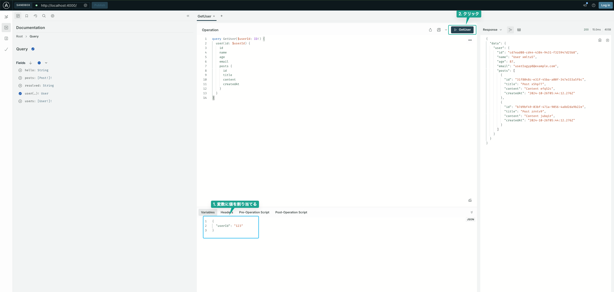

# クローン後の環境構築
パッケージのインストール
```
npm i
```

起動できるか確認
```
npm run start
```

### 起動後にエラーで落ちた場合の対処法
```
Logs for your project will appear below. Press Ctrl+C to exit.
Error: EMFILE: too many open files, watch
    at FSEvent.FSWatcher._handle.onchange (node:internal/fs/watchers:207:21)
```
1. watchmanをインストール
```
brew install watchman
```

2. node_modulesを再インストール
```
rm -rf node_modules
npm install
```

以下にアクセス web版が立ち上がる
http://localhost:8081

## Android で立ち上げる場合のセットアップ
ドキュメント
https://docs.expo.dev/workflow/android-studio-emulator/

Android emulator 起動するための手順はこちらのほうがわかりやすい。
https://kasyalog.site/blog/react-native-expo-ios-android-emulator/

二つのドキュメントを見た後に以下のコマンドを打つと立ち上がる
```
npm run android
```

## iosで立ち上げる手順
ドキュメント
https://docs.expo.dev/workflow/ios-simulator/

https://kasyalog.site/blog/react-native-expo-ios-android-emulator/

```
npm run ios
```

## UI選定
ダウンロード数が一番多いreact-native-paperを使用
https://callstack.github.io/react-native-paper/docs/guides/getting-started/

## モックサーバーを立ち上げるには
```
npm run server
```
http://localhost:4000/ へアクセス

Apollo Sandboxの使い方の例
